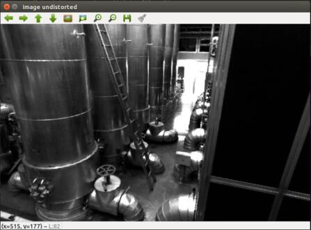
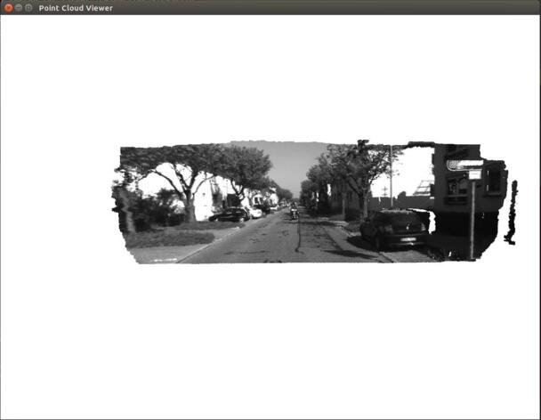
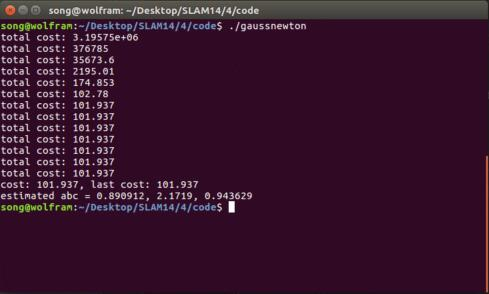

## 2.图像去畸变

```cpp
double x = (u -cx)/fx;
double y = (v -cy)/fy;
double r2= pow(x,2)+pow(y,2);
double r4= pow(r2,2);
double x_distorted = x*(1+k1*r2+k2*r4)+2*p1*x*y+p2*(r2+2*x*x);
double y_distorted = y*(1+k1*r2+k2*r4)+p1*(r2+2*y*y)+2*p2*x*y;
u_distorted = x_distorted*fx+cx;
v_distorted = y_distorted*fy+cy;
```




## 3.双目视差的使用

```cpp
double dis = disparity.at<uchar>(v, u);
double z = fx * d / dis;
double x = z * (u - cx) / fx;
double y = z * (v - cy) / fy;
point(0) = x;
point(1) = y;
point(2) = z;
pointcloud.push_back(point);
```




## 4.矩阵微分

设变量 $x\in R^N $， 那么：

1. $A\in R^{N\times N}$， 那么 $d(Ax)/dx =d(A^T,x)/ dx =d(x,A^T)/dx = dx^T A^T/dx =A^T $

2. $A\in R^{N\times N}$， 那么 $d(x^T Ax)/dx =(A+A^T)x$

   ​	$f(x)=x^T Ax =\Sigma _{j=1}^n \Sigma_{i=1}^n a_{ij}x_i x_j $

   ​	$\frac{df(x)}{dx}=\Sigma _{j=1}^n a_{kj} x_j +\Sigma_{i=1}^n a_{ik}x_k$

   ​	$ = Ax +A^T x=(A+A^T)x$

3. 证明 $xA^T x=tr(Axx^T)$

   先证 $x^T y =tr(xy^T) = tr(yx^T)$

   $x^T y  = \Sigma _{i=1}^n x_i y_i$

   $yx^T = \begin{bmatrix} y_1x_1 &y_1x_2 &\cdots & y_1 x_n\\  y_2 x_1 &y_2 x_2 &\cdots & y_2  x_n\\  \vdots & \vdots &\ddots & \vdots\\  y_n x_1 &y_n x_2 &\cdots & y_n  x_n\\  \end{bmatrix}$

   $tr(yx^T) = \Sigma _{i=1}^n y_i x_i$

   同理推出 $x^T y =tr(xy^T) = tr(yx^T)$

   令$Ax = y$

   推出 $x^T Ax=tr(Axx^T)$

   证毕

## 5.高斯牛顿法的曲线拟合实验

```cpp
double error = 0;// 第i个数据点的计算误差
error = yi- exp(ae * xi * xi + be * xi + ce);// 填写计算error的表达式
Vector3d J; // 雅可比矩阵
J[0] = -exp(ae * xi * xi + be * xi + ce)*xi*xi;  // de/da
J[1] = -exp(ae * xi * xi + be * xi + ce)*xi;  // de/db
J[2] = -exp(ae * xi * xi + be * xi + ce);  // de/dc

H += J * J.transpose(); // GN近似的H
b += -error * J;
```


```cpp
Vector3d dx;
dx = H.ldlt().solve(b);
```


