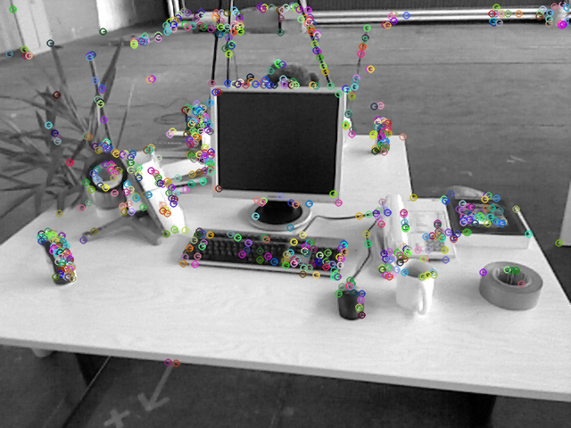
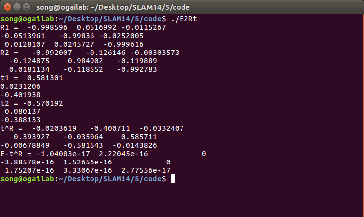
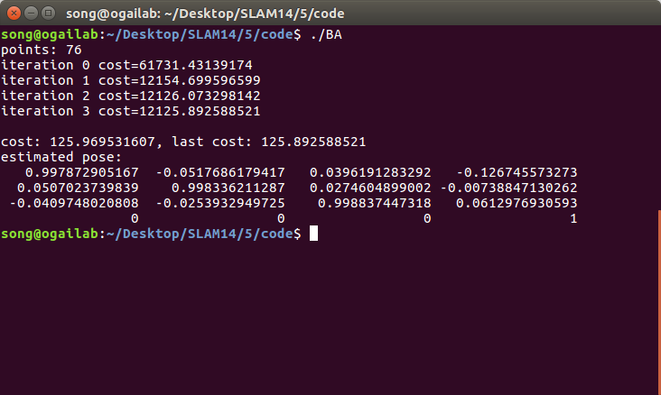

# 2.ORB 特征点

## ORB 提取

```cpp
// compute the angle
void computeAngle(const cv::Mat &image, vector<cv::KeyPoint> &keypoints)
{
    int half_patch_size = 8;
    for (auto &kp : keypoints)
    {
        // START YOUR CODE HERE (~7 lines)
        kp.angle = 0; // compute kp.angle
        double m_10 = 0, m_01 ,m =0;
        if (kp.pt.x<half_patch_size || kp.pt.x >= ( image.cols-half_patch_size) || kp.pt.y <half_patch_size || kp.pt.y >= (image.rows-half_patch_size))
            continue;
        for (int u =-half_patch_size;u<half_patch_size;u++)
        {
            for (int v = -half_patch_size;v<half_patch_size;v++)
            {
                m=image.at<uchar>(cvRound(v+kp.pt.y) ,cvRound(u+kp.pt.x));
                m_10 += u*m;
                m_01 += v*m;
            }
        }
        kp.angle = double( atan2(m_01,m_10));
        // END YOUR CODE HERE
    }
    return;
}
```




## ORB 描述

```cpp

// compute the descriptor
void computeORBDesc(const cv::Mat &image, vector<cv::KeyPoint> &keypoints, vector<DescType> &desc)
{
    int bad = 0;
    for (auto &kp : keypoints)
    {
        DescType d(256, false);
        double angle =kp.angle;
        //cout<<"angle 180: "<<angle<<" angle pi"<<kp.angle<<endl;
        for (int i = 0; i < 256; i++)
        {
            // START YOUR CODE HERE (~7 lines)
            d[i] = 0; // if kp goes outside, set d.clear()
            //旋转
            int p_x=int(ORB_pattern[i*4+0]*cos(angle) - ORB_pattern[i*4+1]*sin(angle) ) +kp.pt.x;
            int p_y=int(ORB_pattern[i*4+0]*sin(angle) + ORB_pattern[i*4+1]*cos(angle) ) +kp.pt.y;
            int q_x=int(ORB_pattern[i*4+2]*cos(angle) - ORB_pattern[i*4+3]*sin(angle) ) +kp.pt.x;
            int q_y=int(ORB_pattern[i*4+2]*sin(angle) + ORB_pattern[i*4+3]*cos(angle) ) +kp.pt.y;

            if (p_x<0||p_x>=image.cols|| p_y<0|| p_y >=image.rows|| q_x<0||q_x>=image.cols|| q_y<0|| q_y >=image.rows)
            {
                d.clear();
                //cout<<"clear============="<<d[0]<<" "<<d[1]<<" "<<d[2]<<" "<<d[3]<<" "<<d[4]<<" "<<d[5]<<" "<<endl;
                break;
            }
            d[i]= image.ptr<uchar>(p_y)[p_x] <  image.ptr<uchar>(q_y)[q_x] ? 1 : 0  ;
            //cout<<d[i]<<" ";
            // END YOUR CODE HERE
        }
        //cout<<endl<<"======================================="<<endl;
        desc.push_back(d);
    }
    cout << "bad/total: " << bad << "/" << desc.size() << endl;
    return;
}
```


## 暴力匹配
```cpp

// brute-force matching
void bfMatch(const vector<DescType> &desc1, const vector<DescType> &desc2, vector<cv::DMatch> &matches)
{
    int d_max = 50;
    // START YOUR CODE HERE (~12 lines)
    // find matches between desc1 and desc2.
    for(int i =0;i<desc1.size();i++)
    {
        const DescType& d1=desc1[i];
        if(d1.empty())
            continue;

        cv::DMatch m;
        m.distance=256;

        for (int j = 0;j<desc2.size();j++)
        {
            const DescType& d2=desc2[j];
            if(d2.empty())
                continue;
            int distance =0;
            for (int k = 0;k<256;k++)
            {
                if (d2[k]!=d1[k])
                    distance++;
            }
            if (distance<m.distance )
            {
                m.queryIdx=i;
                m.trainIdx=j;
                m.distance=distance;
            }

        }
        if(m.distance<d_max)
        {
            //cout<<"matcher distance: "<<m.distance<<endl;
            matches.push_back(m);
        }
    }


    // END YOUR CODE HERE

    for (auto &m : matches)
    {
        cout << m.queryIdx << ", " << m.trainIdx << ", " << m.distance << endl;
    }
    return;
}

```


### ORB 是二进制描述

因为ORB是用 0 1 来表示 A位和B位像素的大小关系，然后是一串01数组。

### 匹配时的阈值

阈值变大，误匹配会增加。

阈值变小，误匹配会减少。点数会减少。

### 优化暴力匹配

暴力匹配比较耗时。

将描述子存进KNN，用 KNN 减少搜索描述子的时间，不用都遍历。


# 3.从 E  恢复 R,t

```cpp
int main(int argc, char **argv) {

    // 给定Essential矩阵
    Matrix3d E;
    E << -0.0203618550523477, -0.4007110038118445, -0.03324074249824097,
            0.3939270778216369, -0.03506401846698079, 0.5857110303721015,
            -0.006788487241438284, -0.5815434272915686, -0.01438258684486258;

    // 待计算的R,t
    Matrix3d R;
    Vector3d t;

    // SVD and fix sigular values
    // START YOUR CODE HERE

    // END YOUR CODE HERE

    // set t1, t2, R1, R2 
    // START YOUR CODE HERE
    Matrix3d t_wedge1;
    Matrix3d t_wedge2;

    Matrix3d R1;
    Matrix3d R2;
    // END YOUR CODE HERE

    cout << "R1 = " << R1 << endl;
    cout << "R2 = " << R2 << endl;
    cout << "t1 = " << Sophus::SO3d::vee(t_wedge1) << endl;
    cout << "t2 = " << Sophus::SO3d::vee(t_wedge2) << endl;

    // check t^R=E up to scale
    Matrix3d tR = t_wedge1 * R1;
    cout << "t^R = " << tR << endl;

    return 0;
}
```



# 4.用 G-N 实现 Bundle Adjustment 

```cpp
int main(int argc, char **argv)
{

    VecVector2d p2d;
    VecVector3d p3d;
    Matrix3d K;
    double fx = 520.9, fy = 521.0, cx = 325.1, cy = 249.7;
    K << fx, 0, cx, 0, fy, cy, 0, 0, 1;

    // load points in to p3d and p2d
    // START YOUR CODE HERE
    ifstream fin(p3d_file);
    for (int i = 0; i < 76; i++)
    {
        double data[3] = {0};
        for (auto &d : data)
            fin >> d;
        Eigen::Vector3d 3d(data[0], data[1], data[2]);
        p3d.push_back(3d);
    }

    ifstream fin(p2d_file);
    for (int i = 0; i < 76; i++)
    {
        double data[2] = {0};
        for (auto &d : data)
            fin >> d;
        Eigen::Vector3d 2d(data[0], data[1]);
        p2d.push_back(2d);
    }

    // END YOUR CODE HERE
    assert(p3d.size() == p2d.size());

    int iterations = 100;
    double cost = 0, lastCost = 0;
    int nPoints = p3d.size();
    cout << "points: " << nPoints << endl;
    Sophus::SE3 T_esti; // estimated pose

    for (int iter = 0; iter < iterations; iter++)
    {

        Matrix<double, 6, 6> H = Matrix<double, 6, 6>::Zero();
        Vector6d b = Vector6d::Zero();
        Mat R;

        cost = 0;
        // compute cost

        for (int i = 0; i < nPoints; i++)
        {
            // compute cost for p3d[I] and p2d[I]
            // START YOUR CODE HERE

            u = p2d[i][0];
            v = p2d[i][1];

            x = p3d[i][0];
            y = p3d[i][1];
            z = p3d[i][2];
            P_i = Vector4d(x, y, z, 1);
            P = Vector3d(K * T_esti.matrix() * P_i[0], K * T_esti.matrix() * P_i[1], K * T_esti.matrix() * P_i[2]);

            cost += sqrt(pow(fx * P[0] / P[2] + cx, 2) + pow(fy * P[1] / P[2] + cy, 2))

                // END YOUR CODE HERE

                // compute jacobian
            Matrix<double, 2, 6> J;
            // START YOUR CODE HERE
            J << fx / P[2], 0, -fx * P[0] / (P[2] * P[2]), -fx * P[0] * P[1] / (P[2] * P[2]), fx + fx * P[0] * P[0] / (P[2] * P[2]), -fx * P[1] / P[2],
                0, fy / P[2], -fy * P[1] / (P[2] * P[2]), -fy - fy * P[1] * P[1] / (P[2] * P[2]), fy * P[0] * P[1] / (P[2] * P[2]), fy * P[0] / P[2];
            J = -J;
            // END YOUR CODE HERE

            H += J.transpose() * J;
            b += -J.transpose() * e;
        }

        // solve dx
        Vector6d dx;

        // START YOUR CODE HERE
        dx = H.ldlt().solve(b);
        // END YOUR CODE HERE

        if (isnan(dx[0]))
        {
            cout << "result is nan!" << endl;
            break;
        }

        if (iter > 0 && cost >= lastCost)
        {
            // cost increase, update is not good
            cout << "cost: " << cost << ", last cost: " << lastCost << endl;
            break;
        }

        // update your estimation
        // START YOUR CODE HERE
        T_esti=Sophus::SE3::exp(dx)*T_esti;
        // END YOUR CODE HERE

        lastCost = cost;

        cout << "iteration " << iter << " cost=" << cout.precision(12) << cost << endl;
    }

    cout << "estimated pose: \n"
         << T_esti.matrix() << endl;
    return 0;
}

```



### 重投影误差

` cost += sqrt(pow(fx * P[0] / P[2] + cx, 2) + pow(fy * P[1] / P[2] + cy, 2))`

重投影出来的点和原先的点的欧氏距离为一对误差，然后对所有点对求和。

### 误差关于自变量的雅可比矩阵

```cpp
 J << fx / P[2], 0, -fx * P[0] / (P[2] * P[2]), -fx * P[0] * P[1] / (P[2] * P[2]), fx + fx * P[0] * P[0] / (P[2] * P[2]), -fx * P[1] / P[2],
                0, fy / P[2], -fy * P[1] / (P[2] * P[2]), -fy - fy * P[1] * P[1] / (P[2] * P[2]), fy * P[0] * P[1] / (P[2] * P[2]), fy * P[0] / P[2];
            J = -J;
```

### 解出更新量之后，如何更新至之前的估计上

```cpp
  T_esti=Sophus::SE3::exp(dx)*T_esti;
```


